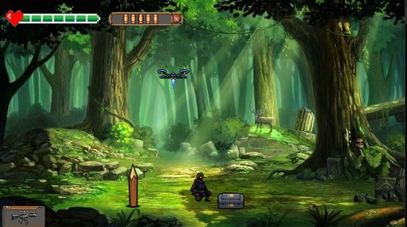

# Quantum Soldier - Tactical Math Infiltration

## Visão Geral
**Quantum Soldier** é um jogo 2D top-down desenvolvido em linguagem C pura, utilizando a biblioteca gráfica **Allegro**. O projeto mescla mecânicas de infiltração tática com resolução de problemas matemáticos sob pressão. Com um apelo visual em *pixel art* inspirado na era 16-bits (estética Nintendo), o jogo atua como um *Serious Game* (jogo educacional), onde o raciocínio lógico e matemático é a mecânica central de sobrevivência.

## Game Design & Narrativa

### High Concept
O jogador controla um soldado das forças especiais aposentado (agora professor de matemática) que é reconvocado para uma missão crítica: infiltrar-se em uma base inimiga/alienígena protegida por sistemas de segurança de criptografia lógica. Para sobreviver e avançar, reflexo e mira não são suficientes; a progressão exige resolução matemática em tempo real.

### Pilares do Jogo
* **Reflexão e Raciocínio Sob Pressão:** Resolução rápida de enigmas com limitação de tempo.
* **Gestão de Recursos via Lógica:** A matemática atua como moeda de troca para ações táticas.
* **Estética Retrô:** Foco em clareza visual e mecânicas diretas.

### Core Mechanics (Mecânicas Principais)
* **Movimentação:** Controle bidimensional (eixos X e Y) via setas do teclado.
* **Sistema de Engajamento e Puzzles:** * **Destrancamento de Portas/Fases:** Interação com terminais exige o cálculo de expressões matemáticas para liberação de acesso.
  * **Economia de Munição (Stealth/Takedown Lógico):** Ao enfrentar um inimigo, o jogador possui a opção de gastar munição (recurso escasso) ou realizar uma eliminação tática solucionando um puzzle matemático.
  * **Recarga de Armamento:** A própria mecânica de *reload* pode estar atrelada a inputs lógicos, forçando o jogador a pensar enquanto evita o fogo inimigo.
* **Condição de Falha:** Errar o cálculo matemático ou esgotar o tempo limite resulta na ativação da segurança inimiga e eliminação do jogador (Game Over).

<p align="center">
  
</p>
---

## Arquitetura Técnica e Engenharia (Linguagem C)

### O Game Loop e Máquina de Estados
A principal complexidade de engenharia neste projeto reside em mesclar **movimentação em tempo real** com **inputs de texto/números** para a resolução dos puzzles.
Para evitar o travamento da thread principal (o que ocorreria ao utilizar funções bloqueantes padrão da `<stdio.h>` como `scanf`), o motor foi estruturado utilizando uma rigorosa Máquina de Estados Finitos (FSM):

1. **Estado de Exploração (`STATE_EXPLORATION`):** O motor captura eventos de teclado em tempo real (`ALLEGRO_EVENT_KEY_DOWN` / `KEY_UP`) para atualizar o vetor de posição do personagem e processar colisões (AABB).
2. **Estado de Puzzle/Combate Lógico (`STATE_PUZZLE`):** A movimentação é pausada. O sistema de eventos passa a atuar como um *buffer* de teclado assíncrono, capturando os números digitados pelo jogador para resolver a equação na tela, enquanto um temporizador (`ALLEGRO_TIMER`) continua correndo em *background* para aplicar a pressão de tempo.

### Gerenciamento de Memória e Renderização
* **Double Buffering:** Implementado nativamente via Allegro para garantir que a renderização dos *tilesets* e da UI das equações não cause cintilação (*tearing*).
* **Ausência de Memory Leaks:** Todos os *bitmaps*, temporizadores e filas de eventos são alocados dinamicamente apenas na inicialização (`Game_Init()`) e rigorosamente liberados no encerramento (`Game_Destroy()`), garantindo estabilidade no uso de RAM.

## Como Compilar e Executar

**Dependências:**
* Compilador GCC (MinGW no Windows ou nativo no Linux/macOS).
* Biblioteca **Allegro 5** (incluindo módulos `allegro_image`, `allegro_font`, `allegro_ttf`, `allegro_primitives`).

**Processo de Build (Exemplo via Makefile):**
```bash
# Clone o repositório
git clone [https://github.com/DanielBaptista01/](https://github.com/DanielBaptista01/)[nome-do-repositorio].git
cd [nome-do-repositorio]

# Compile o projeto
make all

# Execute o binário gerado
./game.exe

## Arquitetura Legada e Mapeamento de Débito Técnico (Technical Debt)

Este projeto foi desenvolvido na etapa inicial da minha formação acadêmica. Atualmente, a base de código serve como objeto de estudo para refatoração, separação de responsabilidades e aplicação de boas práticas em C. Abaixo está o mapeamento do débito técnico atual e o *roadmap* de resolução arquitetural:

* **[Problema Atual] Arquitetura Monolítica e Forte Acoplamento:** Todo o escopo do jogo (Game Loop, renderização gráfica, inputs lógicos e física) está concentrado em um único escopo de execução, resultando em um código monolítico de difícil manutenção.
* **[Solução Projetada] Modularização Procedural:** Refatoração do código para múltiplas unidades de compilação (separação em arquivos `.h` e `.c`). O objetivo é isolar a camada de abstração de hardware (Allegro) da camada de regras de negócio (Puzzles e Colisões).
* **[Problema Atual] Gestão de Estado Global:** Dependência de variáveis globais para controlar a pontuação, vida e status do jogador, quebrando o princípio de encapsulamento.
* **[Solução Projetada] Tipos Abstratos de Dados (ADTs):** Substituir as variáveis soltas por `structs` que representem o contexto do jogo e do jogador, passadas por referência (ponteiros) apenas para as funções que estritamente necessitam manipular esses dados.
